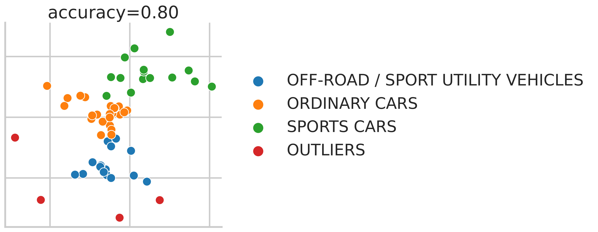

.. cblearn documentation master file, created by
   sphinx-quickstart on Thu Sep 24 11:10:46 2020.
   You can adapt this file completely to your liking, but it should at least
   contain the root `toctree` directive.

Welcome to cblearn's documentation!
===================================

`cblearn` is a Python package for comparison-based machine learning,
which is a type of machine learning where the only available information
is are ordinal comparisons of datapoint similarities.
These comparisons often come from human experiments in the form of triplets (A, B, C)
where A is more similar to B than to C, or from related tasks such as the odd-one-out.

   Examples of similarity comparison tasks, that can be processed with cblearn.
   The most common task is the triplet comparison, where the goal is to find the most similar image (blue) to the reference image (red).
   The show-8-rank-2 task is a variant of the triplet comparison where the goal is to find the second and first most similar image to the reference image.
   The odd-one-out task is a task where the goal is to find the image that is the most dissimilar to the other images,
   Both, the ranking and odd-one-out tasks can be converted to triplet comparisons and
   analyzed with the same algorithms.

**cblearn provides a set of tools to read, convert, and manipulate comparison-based datasets**.
It also provides a set of comparison-based models, including the ordinal embedding and clustering,
that can be used as part of a scikit-learn pipeline.
As such, the package is used by researchers in machine learning to evaluate and
develop new learning algorithms and by researchers in cognitive science to
model perceived similarity in humans.

   This is a 2-D embedding generated from humans selections of the "most representative" car image from three presented (see :ref:`central_car_dataset`).
   The distance in the embedding space represents perceived dissimilarity between the images.
   It appears that cars are grouped by their type in the embedding space.

New users should start in the :ref:`getting_started` section.
Bugs and feature requests are welcome on the `GitHub issue tracker`_.
If you would like to contribute to the code or documentation, please check the :ref:`contributor_guide`.

.. _GitHub issue tracker: https://github.com/cblearn/cblearn/issues

.. toctree::
   :maxdepth: 2
   :caption: Contents of the documentation:

   getting_started/index
   user_guide/index
   generated_examples/index.rst
   references/index
   contributor_guide/index

Indices and tables
==================

* :ref:`genindex`
* :ref:`modindex`
* :ref:`search`
