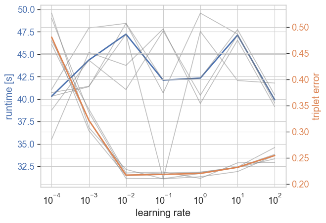

.. _user_guide:

==========
User Guide
==========

Most Machine Learning algorithms use numerical training data (features) for inference,
either representing points in a Euclidean space, similarities, or distances.
There are settings, e.g., in human studies, when obtaining featurized data is difficult, but comparisons are straightforward.
Comparison-based learning algorithms are the machine learning algorithms applicable in this setting,
as they learn from ordinal comparisons between object similarity.

.. _triplet_comparison:

-------------------
Triplet comparisons
-------------------

Triplet comparisons are the most common form of ordinal comparisons. For the triplet of objects :math:`(i, j, k)`
one can ask, "Is the object i more similar to the object j or k?".
For the unknown points :math:`(x_i, x_j, x_k)` and the distance metric :math:`\delta`, the question corresponds to the following
inequality:

.. math::

    \delta(x_i, x_j) \le \delta(x_i, x_k).

Triplets can represented as 2d ``numpy`` arrays, where each row represents a triplet and the columns represent the indices of the objects.
In the library, we call this representation the ordered list format or ``'list-order'``.

.. code-block:: python

    import numpy as np
    triplet_responses = np.array([[0, 1, 2],  # 0 is closer to 1 than 2
                                  [2, 3, 1],
                                  [1, 3, 0]])

In some applications, having a separate array containing the correct response for each triplet is helpful.
This array contains 1 for correct triplets and -1 for incorrect triplets.
The following arrays in the ``'list-count'`` format are equivalent to the previous example.

.. code-block:: python

    triplets = np.array([[0, 1, 2],
                         [2, 1, 3],
                         [1, 0, 3]])
    responses = np.array([1, -1, -1])

These array-based formats are handy in interacting with other machine learning procedures as every row represents a "data point".
Therefore, it is straightforward to sample triplets or split the data into training and test sets.

.. code-block:: python

    from sklearn.model_selection import train_test_split
    X_train, X_test, y_train, y_test = train_test_split(triplets, responses, test_size=0.2)

However, if you want to calculate directly with triplet data, the ``'sparse'`` representation is more suitable.
Here, we use a sparse array with three dimensions and as many entries as there are objects.
Based on the position in the array, entries with -1 and 1 encode whether the triplet is correct or incorrect.

.. code-block:: python

    import sparse
    sp_triplets = sparse.COO(triplets.T, responses, shape=(4, 4, 4))
    sp_triplets[0, 1, 2]  # returns  1
    sp_triplets[2, 1, 3]  # returns -1
    sp_triplets[1, 0, 3]  # returns -1
    sp_triplets[0, 1, 3]  # returns  0

    new_sp_triplets = sp_triplets + another_sp_triplets  # element-wise addition to join two datasets

The triplet-based algorithms in the ``cblearn`` library typically can handle all of the previous.
An ordinal embedding estimator, for example, can train with either of the following:

.. code-block:: python

    from cblearn.embedding import SOE

    soe = SOE(n_components=2)
    soe.fit(triplet_responses)
    soe.fit(triplets, responses)
    soe.fit(sp_triplets)

--------------------------
Scikit-learn compatibility
--------------------------

All estimators in this library are compatible with the ``scikit-learn`` API and can be used in ``scikit-learn`` pipelines
if comparisons are represented in the array format.
The ``scikit-learn`` compatibility is achieved by implementing the ``fit``, ``predict``, and ``score`` methods of the ``BaseEstimator`` class.

The ``fit`` method is used to train the model; the ``predict`` method is used to predict the labels of the test data,
and the ``score`` method is used to evaluate the model on the test data.
In the case of ordinal embedding, for example, the ``predict`` method returns the triplet response according to the embedding
and the ``score`` method returns the triplet accuracy (the fraction of correct triplet responses).

The :ref:`example_ordinal_embedding` example shows how to use a scikit-learn cross validation function with an ordinal embedding estimator.

-------------------------
Pytorch backend (CPU/GPU)
-------------------------

The default backend for computations is the ``scipy`` stack, optimized for fast CPU computations and minimal overhead in both compute and disk space.
However, this comes with limitations when implementing new methods and for calculations with extensive data sets.

As an alternative for some estimators, a ``pytorch`` implementation exists.
These implementations make use of the ``pytorch`` library in multiple ways:
First, the data representation is internally transformed to ``pytorch`` tensors, which allows for automatic differentiation (simplifying the implementation of new loss functions)
Second, the whole computation can run on a GPU, if available.
Third, the stochastic optimization algorithms (we use Adam as the default) are batched,
which means that during each optimization iteration, just a fraction of comparisons are used. This stochastic approach can significantly speed up the optimization process
in the case of extensive datasets. For smaller datasets, the ``pytorch`` implementation is not necessarily faster than the ``scipy`` implementation.
On the contrary, when starting the optimization, there is a particular runtime overhead.
The classic second-order optimizers (which we use in the ``scipy`` backend) converge faster if all data is used in each iteration.
In addition, installing ``pytorch`` required up to 1GB of hard disk space, which is unnecessary for the ``scipy`` backend.

To use this implementation, ``pytorch`` must be installed (see :ref:`extras_install`) and, if necessary,
the option ``backend='torch'`` must be set when instantiating an estimator (see the respective class documentation).
If a CUDA GPU is available, the computations are automatically performed on the GPU (if the computation should be forced to run on a cpu,
set the `device` argument).

.. code-block:: python

    from cblearn import embedding, datasets

    X, y = datasets.fetch_material_similarity(return_triplets=True)
    soe = embedding.SOE(n_components=2, backend='torch', device='cpu')
    soe.fit(X, y)  # this might run a while
    print(soe.embedding_)

As an optimizer, the `pytorch` backend uses the Adam optimizer by default, which is relatively sensitive to
the learning rate parameter. The learning rate should be tuned for the specific problem for peak performance,
for example by using a `grid search`_.

.. _`grid search`: https://scikit-learn.org/stable/modules/generated/sklearn.model_selection.GridSearchCV.html

   The Adam optimizer's runtime and error depend highly on the learning rate hyperparameter.
   Here, we show this dependence with a minimal CKL implementation using PyTorch on the :ref:`Vogue Dataset <nature_vogue_dataset>` (60 objects).

-------------------------
Dataset loading utilities
-------------------------

.. include:: ../../cblearn/datasets/descr/musician_similarity.rst
.. include:: ../../cblearn/datasets/descr/food_similarity.rst
.. include:: ../../cblearn/datasets/descr/car_similarity.rst
.. include:: ../../cblearn/datasets/descr/imagenet_similarity.rst
.. include:: ../../cblearn/datasets/descr/things_similarity.rst
.. include:: ../../cblearn/datasets/descr/nature_vogue_similarity.rst
.. include:: ../../cblearn/datasets/descr/material_similarity.rst
.. include:: ../../cblearn/datasets/descr/similarity_matrix.rst
